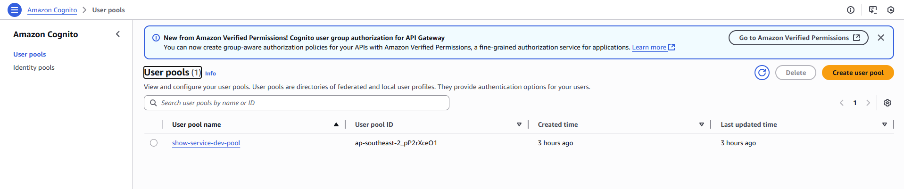

# Show Service Infrastructure

A complete AWS serverless architecture for a show/content management service with authentication, API gateway, containerized application, and NoSQL database.

## Architecture Overview


### Component Relationships

- **API Gateway** → Routes authenticated requests to private ALB
- **Cognito** → Provides JWT token-based authentication
- **Private ALB** → Load balances traffic to ECS tasks (internal only)
- **ECS Fargate** → Runs containerized Go application (serverless)
- **DynamoDB** → Stores show data with GSI for efficient querying
- **ECR** → Stores Docker images for the application
- **CodeBuild** → CI/CD pipeline for automated deployments

## Quick Start

### Prerequisites

- AWS CLI configured with appropriate credentials
- Terraform >= 1.0
- Docker (for local development)

### Initial Setup

1. **Clone and initialize:**
   ```bash
   git clone <repository-url>
   cd show-service-infra
   terraform init
   ```

2. **Deploy to development:**
   ```bash
   terraform apply -var-file=terraform.dev.tfvars -auto-approve
   ```

3. **Get endpoints:**
   ```bash
   # API Gateway URL
   echo "API Gateway: $(terraform output -raw apigw_url)"

   # ALB URL (internal only)
   echo "ALB: $(terraform output -raw alb_url)"
   ```

## Authentication Flow

### Sequence Diagram: Get Bearer Token


### Sequence Diagram: Authenticated API Request


## API Usage Examples

### Get Bearer Token

```bash
# Get access token using client credentials
TOKEN=$(curl -s -X POST "https://your-apigw-url/oauth/token" \
  -H "Authorization: Basic $(echo -n "client_id:client_secret" | base64)" \
  -H "Content-Type: application/x-www-form-urlencoded" \
  -d "grant_type=client_credentials&scope=https://show-service-dev.api/shows.read" \
  | jq -r '.access_token')
```

### API Requests

```bash
# Get all shows
curl -H "Authorization: Bearer $TOKEN" "https://your-apigw-url/shows"

# Expected: {"response": []} (empty array initially)
```

## Development Setup

### Local Development

1. **Set up environment variables:**
   ```bash
   export APP_ENV=dev
   export APP_DYNAMODB_SHOWSTABLE=shows-dev
   export APP__DYNAMODB__REGION=ap-southeast-2
   export GIN_MODE=debug
   ```

2. **Run locally with DynamoDB Local:**
   ```bash
   # Start DynamoDB Local
   docker run -p 8000:8000 amazon/dynamodb-local

   # Run application
   go run main.go
   ```

### Testing

```bash
# Health check
curl http://localhost:8080/health

# API endpoints (with local DynamoDB)
curl http://localhost:8080/shows
```

## Infrastructure Components

### API Gateway (HTTP API)
- **Routes**: `GET /shows`, `POST /oauth/token`
- **Authentication**: JWT authorizer using Cognito
- **CORS**: Configured for web application access

### Cognito User Pool
- **Authentication**: Client credentials flow
- **Scopes**: `shows.read`, `shows.write`
- **Resource Server**: `https://show-service-dev.api`

### Application Load Balancer (ALB)
- **Type**: Internal (not internet-facing)
- **Security**: Only accessible from API Gateway VPC endpoints
- **Health Check**: `/health` endpoint

### ECS Fargate
- **Compute**: Serverless container orchestration
- **Networking**: AWSVPC mode with private subnets
- **Auto-scaling**: Configurable desired count per environment

### DynamoDB
- **Table**: `shows-dev` (environment-specific)
- **GSI**: `gsi_drm_episode` (drmKey + episodeCount)
- **Billing**: Pay-per-request (serverless)

### ECR Repository
- **Images**: Docker images for Go application
- **Lifecycle**: Latest tag always overwritten

### CodeBuild
- **Trigger**: GitHub webhooks or manual
- **Process**: Build → Docker → ECR → ECS deploy

## Multi-Environment Deployment

| Environment | CPU | Memory | Tasks | Log Retention |
|-------------|-----|--------|-------|---------------|
| dev         | 256 | 512MB | 1     | 3 days        |
| test        | 512 | 1GB   | 1     | 7 days        |
| prod        | 512 | 1GB   | 2     | 14 days       |

### Environment-Specific Commands

```bash
# Development
terraform apply -var-file=terraform.dev.tfvars -auto-approve

# Test
terraform apply -var-file=terraform.test.tfvars -auto-approve

# Production
terraform apply -var-file=terraform.prod.tfvars -auto-approve
```

## Security Features

- **Private ALB**: Not accessible from public internet
- **VPC Isolation**: All components in private subnets
- **JWT Authentication**: API Gateway validates all requests
- **Fine-grained Scopes**: Separate read/write permissions
- **Encrypted State**: Terraform state encrypted (when using S3 backend)
- **IAM Roles**: Least privilege access for all services

## Monitoring and Logging

- **CloudWatch Logs**: `/ecs/show-service-{env}` log groups
- **Application Logs**: Structured JSON logging
- **Health Checks**: `/health` endpoint for ALB
- **Error Tracking**: Detailed error responses with proper HTTP codes

## CI/CD Pipeline

### CodeBuild Process

```
GitHub Push → CodeBuild Trigger → Build & Test → Docker Build → ECR Push → ECS Deploy
```

### Manual Deployment

```bash
# Trigger build manually
aws codebuild start-build --project-name $(terraform output -raw codebuild_project_name)

# Monitor build
aws codebuild batch-get-builds --ids $(aws codebuild list-builds --project-name show-service-dev-build --query 'ids[0]' --output text)
```

## Data Model

### DynamoDB Table: `shows-{env}`

**Primary Key**: `slug` (String)

**Attributes**:
- `slug`: Unique identifier
- `title`: Show title
- `drmKey`: DRM status (number)
- `episodeCount`: Number of episodes

**GSI**: `gsi_drm_episode`
- **Hash Key**: `drmKey`
- **Range Key**: `episodeCount`
- **Projection**: All attributes

## Troubleshooting

### Common Issues

1. **"AccessDeniedException" in ECS logs**
   - Check IAM permissions for DynamoDB access
   - Verify table name matches environment variable

2. **"Internal Server Error" from API Gateway**
   - Check ALB health check endpoint
   - Verify ECS task is running and healthy

3. **"Unauthorized" from API Gateway**
   - Check JWT token validity
   - Verify Cognito configuration

### Debug Commands

```bash
# Check ECS task logs
aws logs tail "/ecs/show-service-dev" --follow

# Check ALB target health
aws elbv2 describe-target-health --target-group-arn $(aws elbv2 describe-target-groups --names show-service-dev-tg --query 'TargetGroups[0].TargetGroupArn' --output text)

# Check API Gateway logs
aws logs describe-log-groups --log-group-name-prefix "/aws/apigateway"
```

## Sample Screenshots

### Cognito



### CodeBuild


### API Gateway


### VPC Endpoint (Connecting API Gateway to ALB)


### ALB


### Target Group


### ECS Cluster


### ECS Service


### ECS Task


### DynamoDB


## Additional Resources

- [AWS API Gateway Documentation](https://docs.aws.amazon.com/apigateway/)
- [AWS Cognito Documentation](https://docs.aws.amazon.com/cognito/)
- [AWS ECS Documentation](https://docs.aws.amazon.com/ecs/)
- [AWS DynamoDB Documentation](https://docs.aws.amazon.com/dynamodb/)

---

**Architecture**: Serverless microservice with JWT authentication, private networking, and automated deployments.
